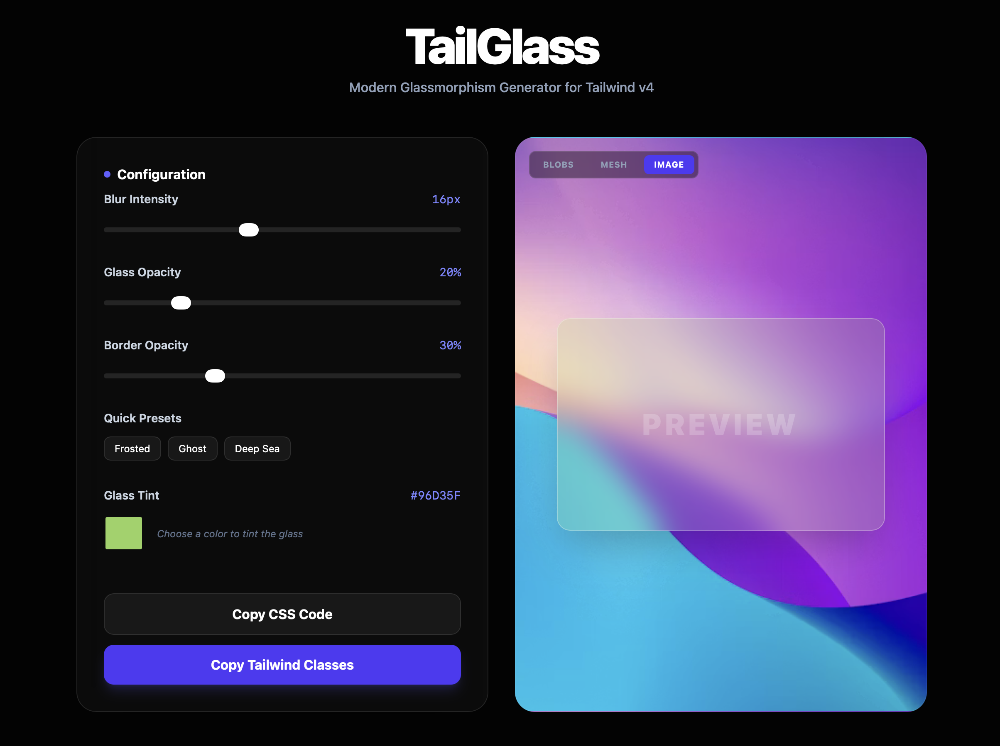

# TailGlass

A modern, interactive visual generator for Glassmorphism UI components. Built entirely with React and Tailwind CSS v4.

## What is this?

Writing the CSS for a clean glassmorphism effect by hand is a bit of a pain. You end up constantly tweaking background opacities, backdrop blurs, and border transparencies, only to realise it looks terrible when you place it over an actual image.

I built TailGlass to fix that workflow. It's a visual sandbox that lets you dial in the exact glass effect you want, test it against different background contexts, and instantly copy the production-ready code. 

## Features

* **Live Sliders:** Real-time control over blur intensity, background opacity, and border transparency.
* **Dynamic Colour Tinting:** Customise the base hex colour of your glass to fit light, dark, or branded themes.
* **Context Testing:** Toggle between default blobs, mesh gradients, and high-res photography to ensure your text stays readable in real-world scenarios.
* **Quick Presets:** One-click buttons for standard looks like 'Frosted', 'Ghost', and 'Deep Sea'.
* **Dual Export:** Export to raw CSS or instantly copy the exact string of Tailwind v4 utility classes.
* **Modular Architecture:** Built with clean, separated React components for easy scaling.

## Tech Stack

* **Framework:** React (via Vite)
* **Styling:** Tailwind CSS v4
* **State Management:** React `useState` hooks

## Running it locally

If you want to pull this down and run it on your own machine, you'll need Node.js installed.

1. Clone the repository:
   `git clone https://github.com/SriVigneswaran7/tailglass.git`

2. Navigate into the directory:
   `cd tailglass`

3. Install the dependencies:
   `npm install`

4. Start the development server:
   `npm run dev`

## How to use it

1. Adjust the Configuration sliders until the preview card matches your design.
2. Use the background toggles in the top-left of the preview window to test how the glass reacts to different lighting and images.
3. Once you're happy, hit either **Copy CSS Code** or **Copy Tailwind Classes**.
4. Paste the generated code directly into your project.

---

*Built by Sri Vigneswaran as a tool to speed up UI development.*
